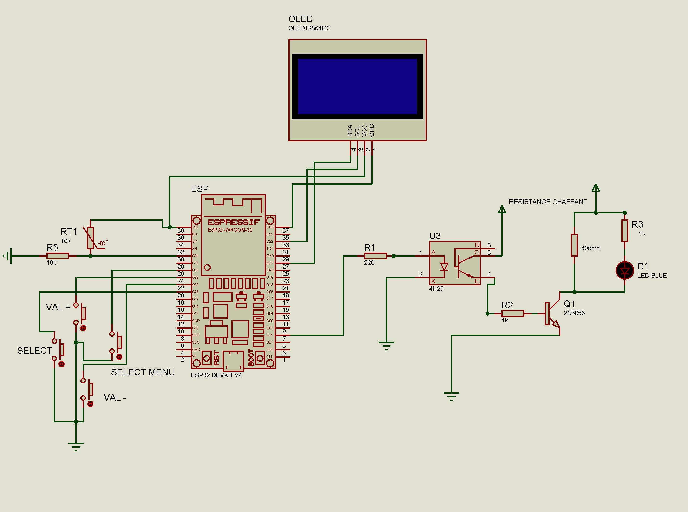
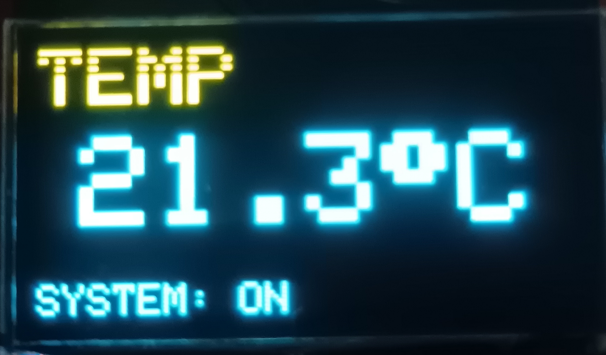
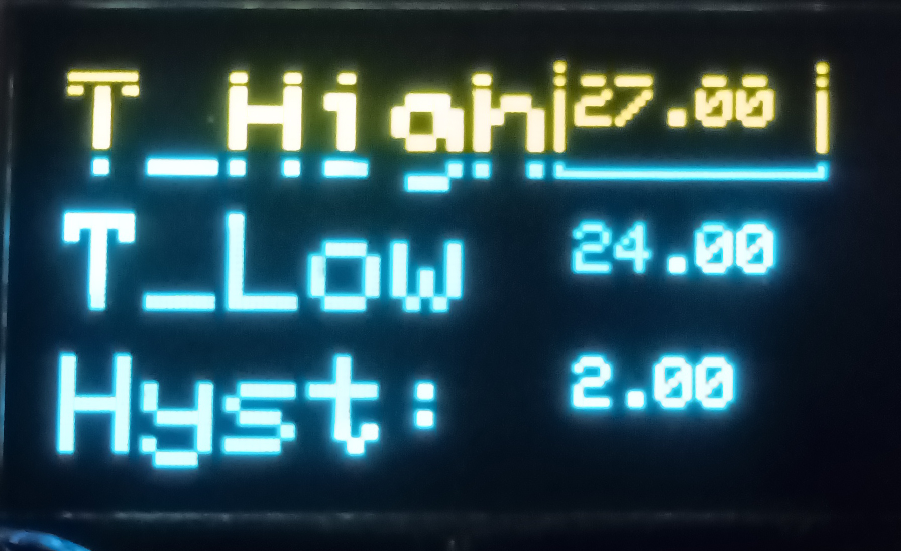
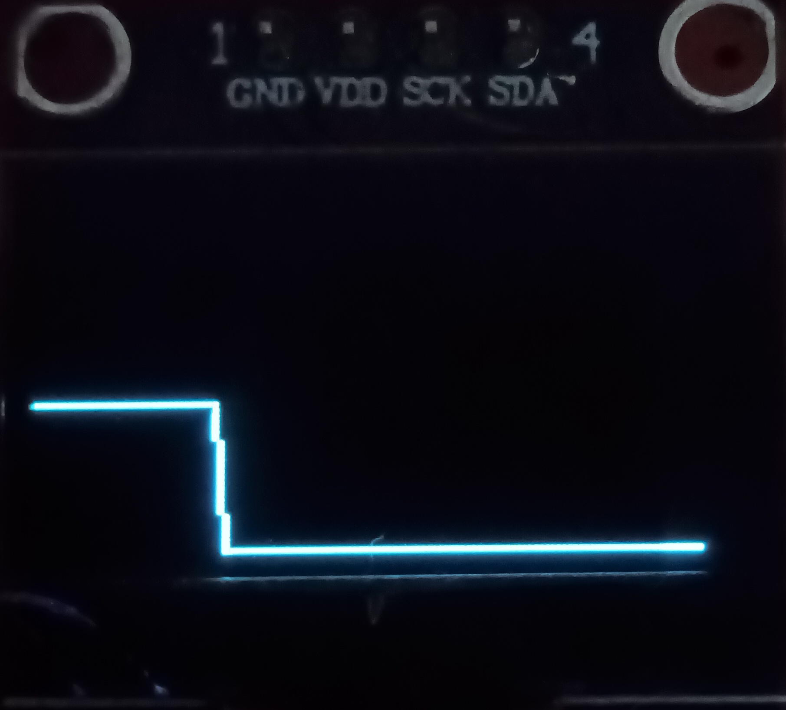
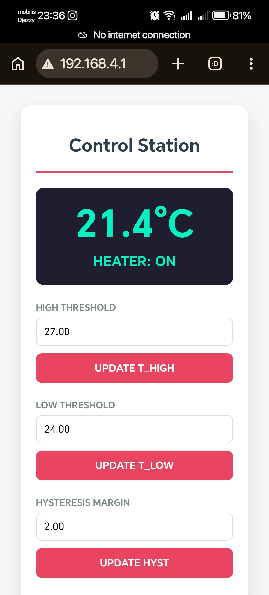
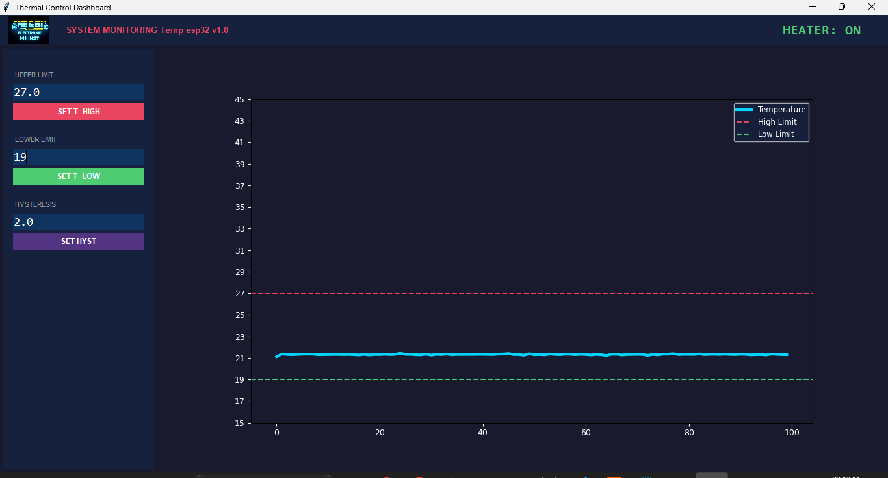

# 🌡️ Smart ESP32 Temperature Control System

A modular temperature regulation system using an **ESP32**. It implements **Hysteresis Control** to maintain stable thermal conditions, featuring a triple-interface monitoring system (OLED, Web, and Python).

<p align="center">
  
</p>

## 📁 Project Structure
The repository is organized as follows:
- `/Assets/`: Contains project logo and circuit diagrams.
- `/Shema sur Proteus/`: Contains the simulation file and schematic of the circuit.
- `/Esp32 Pyhton interface/`: Contains `miniprojet.py` for real-time monitoring.
- `/Esp32Temp ino/`: Contains `Esp32Temp.ino` for the hardware control logic.

## 🚀 Features
- **Hysteresis Regulation:** Precise On/Off control between $T_{low}$ and $T_{high}$.
- **Multi-Platform Monitoring:**
  - **Local:** SSD1306 OLED display with menu navigation.
  - **Web:** Embedded Web Server (WiFi) for remote parameter tuning.
  - **PC:** Real-time Python GUI (Tkinter & Matplotlib).
## ⚙️ Control Logic
The system utilizes a **Hysteresis Control Loop** to maintain thermal stability:
- **Hysteresis Deadband:** Acts as a buffer to prevent rapid relay switching (chattering) when the temperature hovers around the setpoints.
- **Filtering:** Uses a moving average algorithm on the NTC sensor readings to eliminate noise and ensure a stable control signal.

## 📋 Pinout Configuration
| Component | ESP32 GPIO | Function |
| :--- | :--- | :--- |
| NTC Sensor | GPIO 34 | Analog Input |
| Heater Control | GPIO 15 | ON/OFF Output |
| I2C (SDA/SCL) | GPIO 21 / 22 | OLED Communication |
| Buttons | 32, 33, 25, 26 | Menu / Plus / Minus / Select |

<p align="center">
  
</p>


## 🖥️ OLED Menu System
The system features an interactive menu on the OLED display, controlled via physical pushbuttons.

* **Menu 1 (Dashboard):** Displays the system logo and welcome screen.
    
* **Menu 2 (Live Monitor):** Shows the current temperature ($°C$) and the system's operational status (ON/OFF).
    
* **Menu 3 (Parameter Tuning):** Allows manual adjustment of $T_{high}$, $T_{low}$, and Hysteresis values using onboard buttons.
    
* **Menu 4 (Visualization):** Provides a real-time graph of temperature trends over time.
    

## 🌐 Web Interface
The built-in Web Server allows remote monitoring and control. You can view the real-time temperature, system status, and update thermal thresholds directly from your browser.


## 💻 Python Dashboard
The Python interface provides an advanced visualization experience on your PC, utilizing `Matplotlib` for graphing and `Tkinter` for the control dashboard. It communicates via Serial to ensure low-latency data updates.


## 🚀 Getting Started
Follow these steps to run the PC monitoring interface:

1. **Hardware Setup:** Connect your ESP32 via USB and check your Serial Port (e.g., `COM3` or `/dev/ttyUSB0`).
2. **Configure:** Update the `SERIAL_PORT` variable in `miniprojet.py` if necessary.
3. **Run:**
 ```bash
   pip install -r requirements.txt
   python "Esp32 Python Interface/miniprojet.py"

```

## ⚙️ Software & Dependencies
### Firmware (Arduino IDE)
- `Adafruit_SSD1306` & `Adafruit_GFX`
- `WiFi.h`, `WebServer.h`, `Wire.h`

### PC Dashboard (Python)
- `pyserial`: Serial communication.
- `matplotlib`: Real-time graphing.
- `tkinter`: Graphical interface.

## 💡 Technical Specs
- **Sampling Frequency:** 5 Hz (200ms loop delay).
- **Communication:** 115200 baud.
- **Power:** ~0.83W heating power @ 5V.

---
## 🔮 Future Improvements
- **Data Logging:** Store temperature history on an SD Card or Firebase/Cloud for long-term analytics.
- **PID Control:** Implement a PID algorithm instead of simple Hysteresis for more precise temperature regulation.
- **Mobile App:** Develop a dedicated Flutter/React Native app for a better mobile experience.

---

## 📬 Connect with me

<p align="left">
  <a href="https://github.com/MedMA07" target="_blank">
    
  </a>
  <a href="https://www.linkedin.com/in/medma7/" target="_blank">
    
  </a>
  <a href="mailto:elaminemed.ad@gmail.com">
    
  </a>
  <a href="https://wa.me/213668598710" target="_blank">
    
  </a>
  <a href="https://linktr.ee/el.amine.m" target="_blank">
    
  </a>
  <a href="https://www.facebook.com/el.aminem07/" target="_blank">
    
  </a>
  <a href="https://www.instagram.com/el.amine.m/" target="_blank">
    
  </a>
  <a href="https://www.snapchat.com/@med_ma7" target="_blank">
    
  </a>
</p>

*Developed as a comprehensive project for Embedded Systems & IoT monitoring.*
